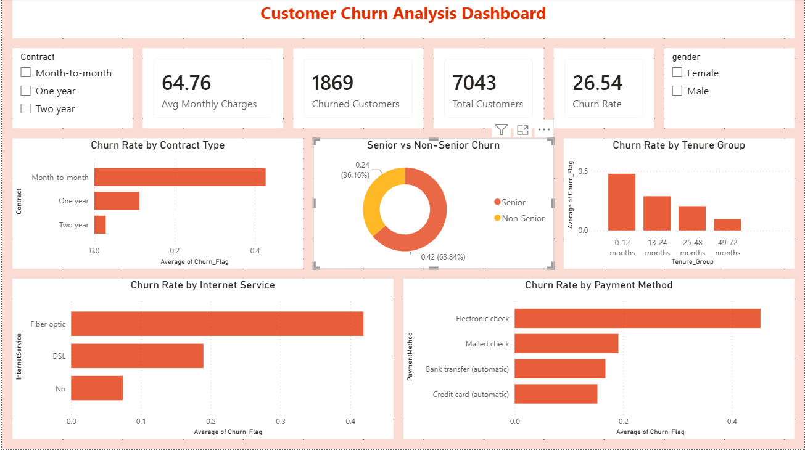
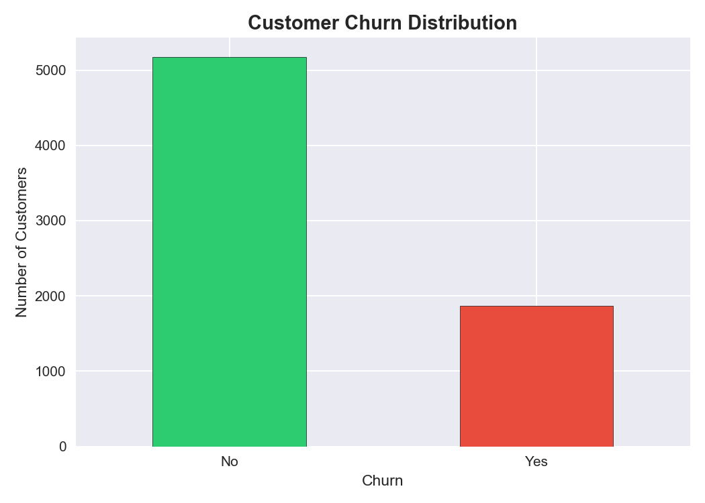
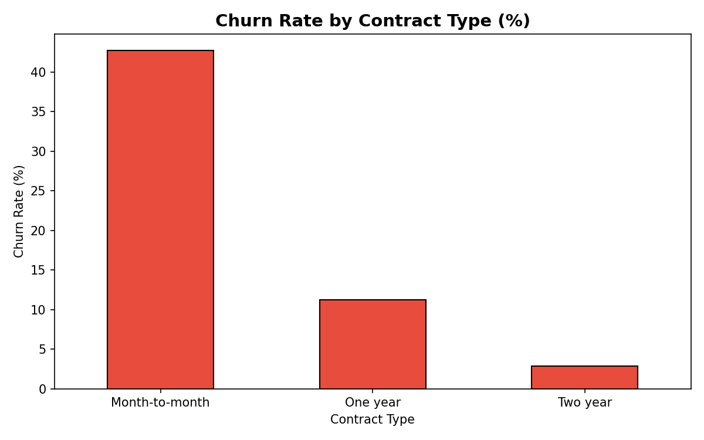
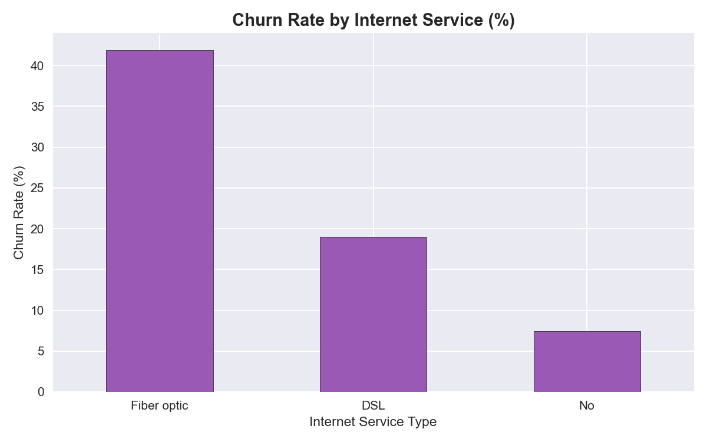
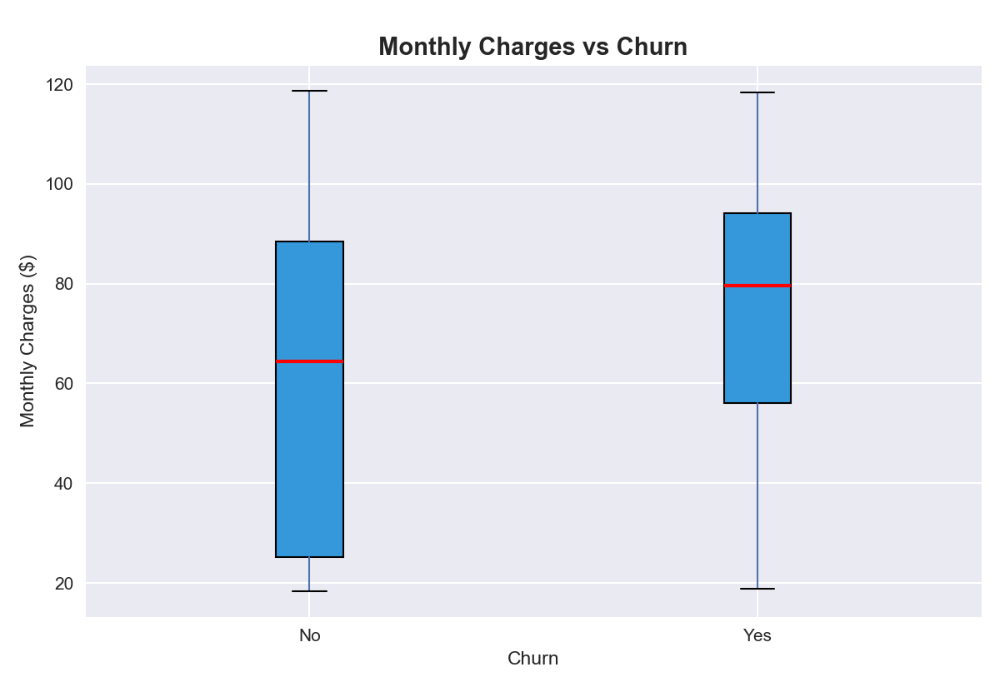
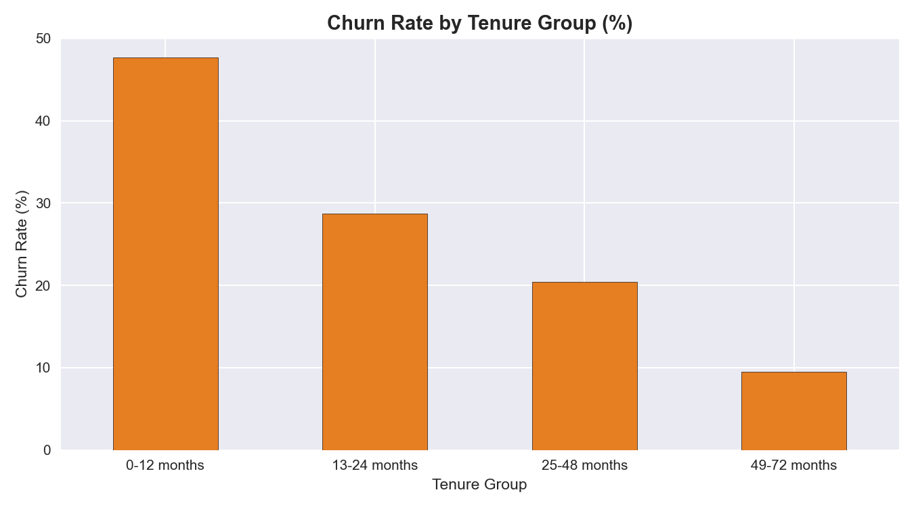
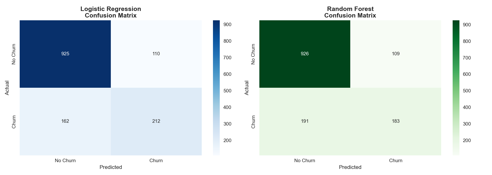
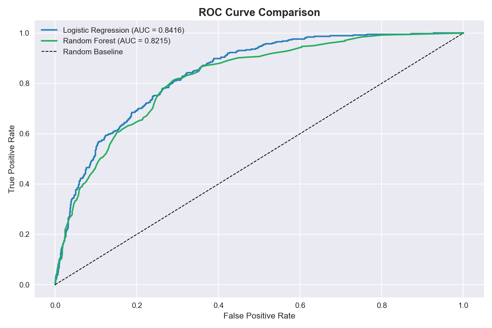
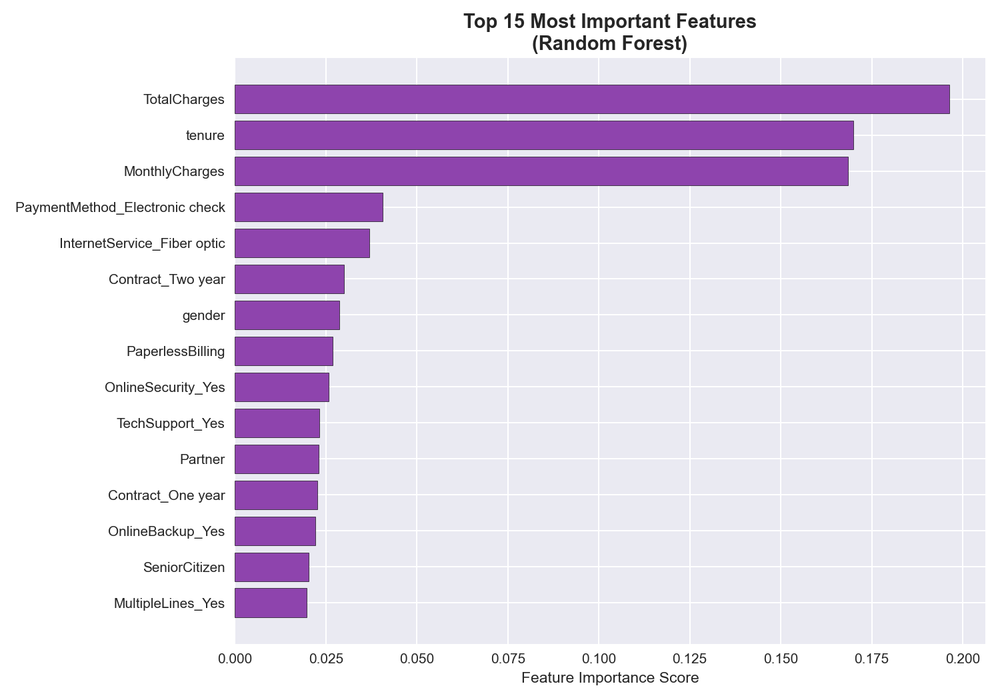

# 📉 Customer Churn Prediction

## 📌 Project Overview
A telecom company is losing customers at an alarming rate of 26.5%. 
This project analyzes customer behavior to identify key churn drivers 
and builds a Machine Learning model to predict which customers are 
likely to leave — enabling the business to take proactive retention action.

---

## 🎯 Business Problem
> **"Can we predict which customers will leave before they actually do?"**

With 1,869 out of 7,043 customers churning, the company needed a 
data-driven solution to identify at-risk customers early and reduce 
revenue loss through targeted retention strategies.

---

## 📊 Key Findings

| Insight | Finding |
|---|---|
| 🚨 Overall Churn Rate | 26.5% — 1 in 4 customers leaving |
| 📋 Highest Risk Contract | Month-to-month (42.7% churn) |
| 🌐 Highest Risk Service | Fiber optic customers (41.9% churn) |
| 💳 Riskiest Payment | Electronic check users (45.3% churn) |
| 👶 New Customer Risk | First year customers churn 47.7% |
| 💰 Price Sensitivity | Churned customers pay $13 more/month |
| 👴 Senior Citizens | 41.7% churn vs 23.6% for non-seniors |

---

## 🤖 Machine Learning Results

| Model | Accuracy | ROC-AUC |
|---|---|---|
| ✅ Logistic Regression | 80.70% | 0.8416 |
| 🌲 Random Forest | 78.71% | 0.8215 |

**Best Model: Logistic Regression**
- Correctly identified **212 customers** likely to churn
- Allowing proactive retention for high-risk customers
- ROC-AUC of 0.84 — strong predictive performance

---

## 💡 Business Recommendations

1. **Target month-to-month customers** — Offer discounts to switch 
   to annual contracts. Churn drops from 42.7% to just 2.8% on 
   2-year contracts.
2. **Investigate Fiber optic pricing** — 41.9% churn suggests 
   customers feel overcharged. Review competitor pricing.
3. **Discourage electronic check payments** — Highest churn at 45.3%. 
   Incentivize auto-pay methods with discounts.
4. **Improve new customer onboarding** — 47.7% of first-year 
   customers leave. Introduce a 90-day onboarding program.
5. **Senior citizen retention program** — 41.7% churn rate. 
   Offer simplified plans and dedicated support.

---

## 🛠️ Tools Used

---

## 📁 Project Structure
---

## 📈 Visualizations

### Churn Distribution

### Churn by Contract Type

### Churn by Internet Service

### Monthly Charges vs Churn

### Churn by Tenure Group

### ML Model — Confusion Matrix

### ML Model — ROC Curve

### Feature Importance

---

## 🗄️ SQL Analysis
Key business questions answered using SQL:
- Overall churn rate calculation
- Churn breakdown by contract type
- Internet service churn analysis
- Payment method risk analysis
- Average charges — churned vs stayed
- Senior citizen churn rate
- High risk customer identification
- Churn by tenure group

---

## 🤖 ML Model Details
- **Algorithm:** Logistic Regression & Random Forest
- **Train/Test Split:** 80/20
- **Features Used:** 30+ customer attributes
- **Best Model:** Logistic Regression (Accuracy: 80.70%, AUC: 0.8416)
- **Business Value:** Identifies 56.7% of churning customers for 
  proactive retention

---

## 📌 Dataset
- **Source:** Telco Customer Churn Dataset
- **Platform:** Kaggle
- **Records:** 7,043 customers | 21 features

---

*Created by Priyanka M M | Bengaluru, India*
*Tools: Python • SQL • Power BI • Machine Learning*

